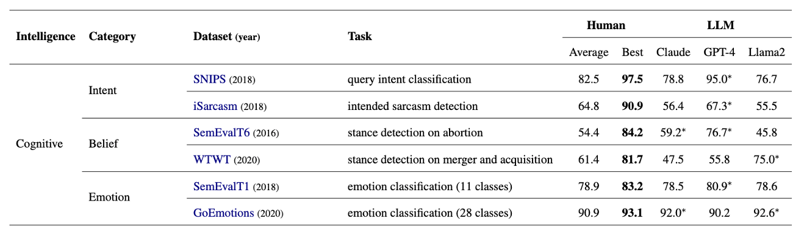
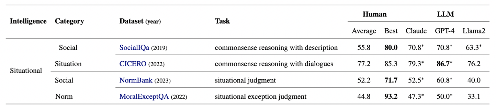
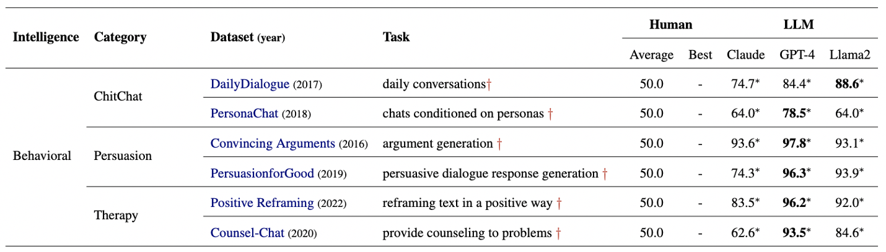

<h1 align='center' style="text-align:center; font-weight:bold; font-size:2.0em;letter-spacing:2.0px;"> Social Intelligence Data Infrastructure: Structuring the Present and Navigating the Future </h1>

<p align='center' style="text-align:center;font-size:1.25em;">
    <a href="https://www.yi-zeng.com/" target="_blank" style="text-decoration: none;">Minzhi Li<sup>1,2</sup></a>&nbsp;,&nbsp;
    <a href="https://wyshi.github.io/" target="_blank" style="text-decoration: none;">Weiyan Shi<sup>3</sup></a>&nbsp;,&nbsp;
    <a href="https://communication.ucdavis.edu/people/jingwen-zhang" target="_blank" style="text-decoration: none;">Caleb Ziems<sup>3</sup></a><br>
    <a href="https://cs.stanford.edu/~diyiy/" target="_blank" style="text-decoration: none;">Diyi Yang<sup>3</sup></a>&nbsp;&nbsp;
    <br/> 
<sup>1</sup>National University of Singapore&nbsp;&nbsp;&nbsp;<sup>2</sup>Agency for Science, Technology and Research (A*STAR)&nbsp;&nbsp;&nbsp;<sup>3</sup>Stanford University
</p>
<p align='center';>
<b>
<em>ACL Findings, 2024</em> <br>
</b>
</p>
<p align='center' style="text-align:center;font-size:2.5 em;">
<b>
    <a href="https://arxiv.org/abs/2403.14659" target="_blank" style="text-decoration: none;">[arXiv]</a>&nbsp;&nbsp;&nbsp;&nbsp;&nbsp;&nbsp;<a href="https://salt-nlp.github.io/Social-Intelligence-Data-Infrastructure/" target="_blank" style="text-decoration: none;">[Project Page]</a>&nbsp;&nbsp;&nbsp;&nbsp;&nbsp;&nbsp;<a href="https://docs.google.com/spreadsheets/d/1jSTmPaqaEVXxoLmt_DCk933PsthMucbIFT7KmZt2Q3A/edit?usp=sharing" target="_blank" style="text-decoration: none;">[Data Library]</a>
</b>
</p>

------------

## Introduction
As Natural Language Processing (NLP) systems become increasingly integrated into human social life, these technologies will need to increasingly rely on social intelligence. Although there are many valuable datasets that benchmark isolated dimensions of social intelligence, there does not yet exist any body of work to join these threads into a cohesive subfield in which researchers can quickly identify research gaps and future directions. Towards this goal, we build a Social AI Data Infrastructure, which consists of a comprehensive social AI taxonomy and a data library of 480 NLP datasets. Our infrastructure allows us to analyze existing dataset efforts, and also evaluate language models' performance in different social intelligence aspects. Our analyses demonstrate its utility in enabling a thorough understanding of current data landscape and providing a holistic perspective on potential directions for future dataset development. We show there is a need for multifaceted datasets, increased diversity in language and culture, more long-tailed social situations, and more interactive data in future social intelligence data efforts.
<p align="center">

</p>

## Taxonomy
To introduce a standardized and comprehensive definition of social intelligence, we propose Social AI Taxonomy, to capture diverse %and scattered dimensions identified in previous work. As shown in the figure below, our taxonomy considers both the social understanding and the social interaction components and is hierarchical with three distinct types of social intelligence based on past literature: (1) cognitive intelligence, (2) situational intelligence, and (3) behavioral intelligence. 
<p align="center">

</p>

## Data Library
We applied keyword filtering and manual verification for papers scraped from ACL Anthology, obtaining a total of 480 NLP datasets on social intelligence. Each dataset has the attribute of year, title, link, type of intelligence, social factor, NLP task, data source, annotation strategy, generation method, data format, language, modality, public availability of the test set. You can access the data library from this [Google Sheet](https://docs.google.com/spreadsheets/d/1jSTmPaqaEVXxoLmt_DCk933PsthMucbIFT7KmZt2Q3A/edit?usp=sharing)

## LLM Performance
### Cognitive Intelligence
Compared to straightforward query intent recognition (95.0 F1), the best performing LLM (GPT-4) struggles more with identifying the intended sarcasm (67.3 F1) when people convey an opposite meaning from what they literally said. Moreover, uncommon tasks with fewer datasets are more challenging, such as stance detection in the economic domain (most stance detection data is for political domain). With more fine-grained definitions on labels, LLMs have better performance in classification as seen from a higher F1 on GoEmotions than SemEvalT1 with more emotion classes defined.
<p align="center">

</p>

### Situational Intelligence
More social context in the data can also result in better performance: LLMs achieve a higher F1 on the CICERO dataset with both social situation description and dialogue data, than the SocialIQa dataset with only a simple description. LLMs also find long-tailed social situations (e.g. moral exceptions) more challenging.
<p align="center">

</p>

### Behavioral Intelligence
LLMs in real-life social applications usually require multiple intelligence (e.g. interpreting intents under different cultural backgrounds) but they are still lacking in performance (CulturalNLI: 65.0). Sections (A)-(C) show they perform well for individual modules, so systems can utilize LLMs for individual modules which LLMs do exceptionally well in and combine them organically to build a strong holistic system (e.g. combine emotion recognition and positive reframing components for a counseling system).
<p align="center">

</p>

## Citation and Contact
If you find this repository helpful, please cite our paper.

```
@misc{li2024social,
                title={Social Intelligence Data Infrastructure: Structuring the Present and Navigating the Future}, 
                author={Minzhi Li and Weiyan Shi and Caleb Ziems and Diyi Yang},
                year={2024},
                eprint={2403.14659},
                archivePrefix={arXiv},
                primaryClass={cs.CY}
}
```

Feel free to contact Minzhi at li.minzhi@u.nus.edu, if you have any questions about the paper.
